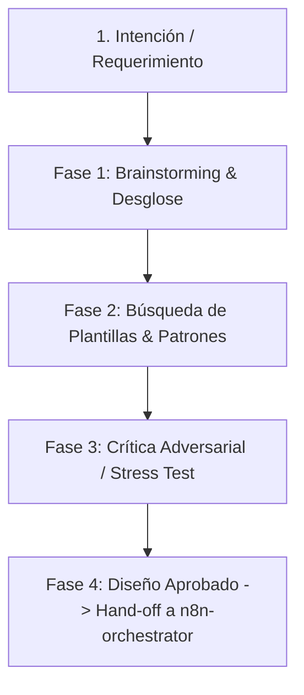

# Skill: n8n-architect (Brainstorming, Patrones y Crítica de Arquitectura)

Este skill define el protocolo obligatorio para idear, buscar referencias y someter a crítica técnica cualquier requerimiento nuevo antes de tocar nodos o código en n8n.

---

## Ciclo de Ejecución de 4 Etapas

---

## Fase 1: Brainstorming & Requerimientos
1. **Definición del Problema:** ¿Qué objetivo de negocio resuelve este flujo?
2. **Entradas & Salidas:** ¿Quién o qué lo dispara (webhook, cron, mensaje, evento de base de datos) y cuál es el resultado tangible (email, mensaje, registro, archivo)?
3. **Sistemas Involucrados:** Listar APIs y servicios necesarios (Chatwoot, Notion, Google Workspace, Slack, LLMs).

---

## Fase 2: Búsqueda de Patrones y Plantillas de n8n
Antes de inventar un flujo de cero, contrastar contra los patrones probados en [`docs/brain/catalogo-patrones.md`](../../docs/brain/catalogo-patrones.md):
- **Event-Driven Webhook:** Procesamiento reactivo en tiempo real con buffer de ráfagas.
- **Asynchronous Polling Cron:** Desacople de procesos largos en tareas programadas periódicas.
- **AI Agent with Tools:** Modelos LLM que ejecutan function calling con fallback de modelos y red de seguridad.
- **Deduplicación e Idempotencia:** Prevención de ejecuciones duplicadas en caso de reintentos de red.

---

## Fase 3: Crítica Adversarial (Design Critic Gate)
Someter el diseño al checklist riguroso de [`docs/brain/criterios-critica.md`](../../docs/brain/criterios-critica.md):
1. **¿Qué pasa si la API externa cae o responde 500?** (Manejo de errores y reintentos).
2. **¿Qué pasa si hay ráfagas de 50 peticiones simultáneas?** (Rate limits y colas).
3. **¿El flujo se puede colgar en `waiting`?** (Prohibir nodos `wait` largos dentro de loops).
4. **¿Se están gastando tokens de LLM innecesariamente?** (Filtrar y resolver con código determinista antes de llamar a la IA).
5. **¿La información sensible está aislada?** (Credenciales sanitizadas, sin exponer tokens en código o prompts).

---

## Fase 4: Documento de Diseño y Hand-off
Generar la ficha técnica preliminar en `docs/brain/proyectos/<id-proyecto>/diseno.md` con:
- Diagrama Mermaid de topología de nodos.
- Mapeo de variables y credenciales necesarias.
- Respuestas a la crítica adversarial.
- Pase formal a [`n8n-orchestrator`](../n8n-orchestrator/SKILL.md) para la construcción en el entorno de desarrollo (DEV).
