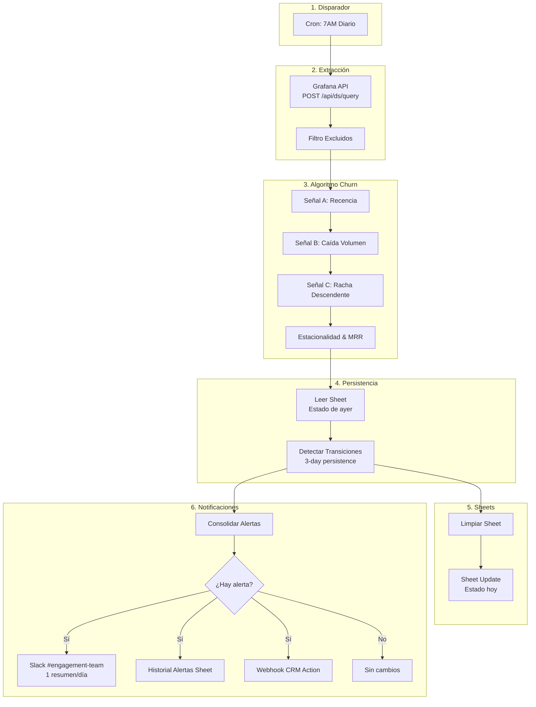
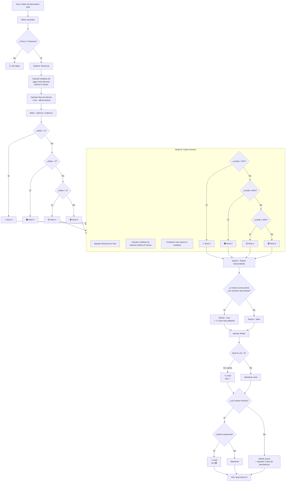

# Documentación Técnica — Análisis de Churn v5

**Workflow:** `Análisis Churn Clientes v5 (Modular & Visual)`
**ID interno:** `iYQYHixhPxKrbeLQ` → migrado a v5 como reemplazo completo
**Versión actual:** v5 (Modular & Visual)
**Estado:** 🟡 Bloqueado — requiere Service Account Token de Grafana
**Ejecución:** Diaria, 7:00 AM (cron `0 7 * * *`)
**Nodos totales:** 12 ejecutables + 10 sticky notes

---

## Índice

1. [Arquitectura General](#1-arquitectura-general)
2. [Flujo de Datos](#2-flujo-de-datos)
3. [Catálogo de Nodos](#3-catálogo-de-nodos)
   - [Schedule Diario 7AM](#31-schedule-diario-7am)
   - [Grafana API — Facturación](#32-grafana-api--facturación)
   - [Filtro Clientes Excluidos](#33-filtro-clientes-excluidos)
   - [Señal A: Recencia](#34-señal-a-recencia)
   - [Señal B: Caída Volumen](#35-señal-b-caída-volumen)
   - [Señal C: Racha Descendente](#36-señal-c-racha-descendente)
   - [Estacionalidad & MRR](#37-estacionalidad--mrr)
   - [Leer Sheet (estado ayer)](#38-leer-sheet-estado-ayer)
   - [Detectar Transiciones](#39-detectar-transiciones)
   - [Limpiar Sheet](#310-limpiar-sheet)
   - [Sheet Update (estado hoy)](#311-sheet-update-estado-hoy)
   - [Consolidar Alertas](#312-consolidar-alertas)
   - [IF ¿Hay alerta?](#313-if-hay-alerta)
   - [Slack Alerta Churn](#314-slack-alerta-churn)
   - [Historial Alertas (Sheet)](#315-historial-alertas-sheet)
   - [Webhook CRM Action (Opcional)](#316-webhook-crm-action-opcional)
   - [Sin cambios (no alertar)](#317-sin-cambios-no-alertar)
4. [Algoritmo de Churn (3 Señales)](#4-algoritmo-de-churn-3-señales)
5. [Variables de Entorno](#5-variables-de-entorno)
6. [Formato de Sheets](#6-formato-de-sheets)
7. [Mantenimiento](#7-mantenimiento)

---

## 1. Arquitectura General



### Flujo lineal de ejecución

```
Schedule → Grafana API → Filtro Excluidos → Señal A → Señal B → Señal C
  → Estacionalidad & MRR → Leer Sheet ayer → Detectar Transiciones
  → [rama 1: Limpiar Sheet → Sheet Update]
  → [rama 2: Consolidar Alertas → IF → Slack/Historial/Webhook o NoOp]
```

---

## 2. Flujo de Datos

### Estructura de datos por etapa

Cada nodo enriquece el objeto JSON del cliente agregando campos. El objeto base comienza así:

```json
{
  "cliente_id": "123",
  "cliente_nombre": "Empresa S.A.",
  "facturas": [
    { "fecha": "2025-08-15", "monto": 1500.00 }
  ]
}
```

### Campos agregados por nodo

| Nodo | Campos agregados |
|------|-----------------|
| Filtro Excluidos | (ninguno, solo filtra) |
| Señal A: Recencia | `ultima_factura`, `cadencia_dias`, `silencio_dias`, `ratio_recencia`, `estado_recencia`, `nivel_recencia`, `insuficiente_historia` |
| Señal B: Caída Volumen | `mesesMap`, `mesesKeys`, `estado_volumen`, `nivel_volumen`, `caida_volumen_pct` |
| Señal C: Racha Descendente | `racha_descendente` |
| Estacionalidad & MRR | `mrr_estimado`, `ajuste_estacional`, `meses_historia`, `estado_final`, `nivel_numerico` |
| Detectar Transiciones | `estado_ayer`, `dias_consecutivos_riesgo`, `transicion`, `empeoro`, `mejoro`, `es_primera_corrida`, `tiene_alerta`, `slack_message` |
| Consolidar Alertas | (genera el mensaje Slack consolidado + lista de empeorados) |

---

## 3. Catálogo de Nodos

### 3.1 Schedule Diario 7AM

| Propiedad | Valor |
|-----------|-------|
| **Tipo** | `n8n-nodes-base.scheduleTrigger` |
| **TypeVersion** | 1.1 |
| **Posición** | (-280, -150) |
| **ID** | `schedule-trigger` |

**Propósito:** Disparador principal del workflow. Ejecuta todo el pipeline una vez al día.

**Parámetros:**
```json
{
  "rule": {
    "interval": [{
      "field": "cronExpression",
      "expression": "0 7 * * *"
    }]
  }
}
```

**Comportamiento:** Corre todos los días a las 7:00 AM. No tiene configuración de zona horaria explícita — usa la del servidor n8n.

---

### 3.2 Grafana API — Facturación

| Propiedad | Valor |
|-----------|-------|
| **Tipo** | `n8n-nodes-base.httpRequest` |
| **TypeVersion** | 4.2 |
| **Posición** | (-30, -150) |
| **ID** | `grafana-query` |

**Propósito:** Extrae 12 meses de facturación desde Grafana usando su API Query, sin necesidad de acceso directo a la base de datos PostgreSQL/MySQL.

**Endpoint:** `POST {{ $env.GRAFANA_URL }}/api/ds/query`

**Autenticación:** HTTP Header Auth — envía `Authorization: Bearer <token>` (el token se configura en el nodo HTTP de n8n como crédential de tipo `httpHeaderAuth`).

**Query SQL ejecutada:**
```sql
SELECT c.id AS cliente_id,
       c.nombre AS cliente_nombre,
       f.fecha_emision,
       f.monto,
       f.numero_factura
FROM clientes c
JOIN facturas f ON f.cliente_id = c.id
WHERE f.fecha_emision >= NOW() - INTERVAL '12 months'
ORDER BY c.id, f.fecha_emision
```

**Body de la petición:**
```json
{
  "queries": [{
    "refId": "A",
    "datasource": { "uid": "{{ $env.GRAFANA_DATASOURCE_UID }}" },
    "rawSql": "...",
    "format": "table"
  }],
  "from": "now-12M",
  "to": "now"
}
```

**Opciones:** `response.response.neverError: true` — si Grafana devuelve error HTTP, no mata el workflow (el error se maneja en el siguiente nodo).

---

### 3.3 Filtro Clientes Excluidos

| Propiedad | Valor |
|-----------|-------|
| **Tipo** | `n8n-nodes-base.code` |
| **TypeVersion** | 2 |
| **Posición** | (250, -150) |
| **ID** | `filtro-exclusiones` |

**Propósito:** Valida la respuesta de Grafana, parsea los frames, arma el mapa de clientes con sus facturas, y excluye los clientes en la lista de pausados.

**Lógica:**
1. Valida que Grafana haya respondido OK (statusCode < 400)
2. Parsea los frames del formato de Grafana (schema + values) a objetos planos
3. Filtra clientes cuyo ID esté en `CHURN_EXCLUDED_CLIENT_IDS`
4. Agrupa facturas por cliente
5. Convierte montos a `float` y fechas a `Date`

**Código completo:** Ver [Anexo: Filtro Clientes Excluidos](#anexo-código-de-nodos)

**Variables de entorno usadas:** `CHURN_EXCLUDED_CLIENT_IDS`

---

### 3.4 Señal A: Recencia

| Propiedad | Valor |
|-----------|-------|
| **Tipo** | `n8n-nodes-base.code` |
| **TypeVersion** | 2 |
| **Posición** | (530, -150) |
| **ID** | `senal-recencia` |

**Propósito:** Calcula la primera señal de churn basada en el silencio del cliente vs su cadencia histórica de facturación.

**Algoritmo:**
1. Toma las facturas de los últimos 6 meses
2. Calcula la **mediana de gaps** entre facturas consecutivas (= cadencia típica)
3. Calcula los días desde la última factura hasta hoy (= silencio actual)
4. Calcula el ratio: `silencio / cadencia`

| Ratio | Estado | Nivel |
|-------|--------|-------|
| > 5× la cadencia | 🔴 Rojo | 3 |
| > 3× la cadencia | 🟠 Naranja | 2 |
| > 2× la cadencia | 🟡 Amarillo | 1 |
| ≤ 2× la cadencia | 🟢 Normal | 0 |

**Casos borde:**
- Si el cliente tiene < 2 facturas → `⚪ Sin datos`, `insuficiente_historia = true`
- Si la cadencia da 0 → ratio = 999 (cae en 🔴 Rojo)
- Usa **mediana** (no promedio) para evitar que gaps extremos sesguen el cálculo

---

### 3.5 Señal B: Caída Volumen

| Propiedad | Valor |
|-----------|-------|
| **Tipo** | `n8n-nodes-base.code` |
| **TypeVersion** | 2 |
| **Posición** | (810, -150) |
| **ID** | `senal-volumen` |

**Propósito:** Calcula la segunda señal comparando el volumen de facturas del mes actual (en la misma ventana día-a-día) contra la mediana de los últimos 6 meses.

**Algoritmo:**
1. Agrupa facturas por mes calendario
2. Para cada mes, cuenta cuántas facturas cayeron **hasta el día de hoy** (`totalVentana`)
3. Toma los últimos 6 meses completos como línea base
4. Calcula la **mediana** de esos 6 meses
5. Compara el mes actual contra esa mediana

| Caída % | Estado | Nivel |
|---------|--------|-------|
| ≥ 70% | 🔴 Rojo | 3 |
| ≥ 50% | 🟠 Naranja | 2 |
| ≥ 30% | 🟡 Amarillo | 1 |
| < 30% | 🟢 Normal | 0 |

**Por qué ventana día-a-día:** Si hoy es 15 de julio, compara los primeros 15 días de julio contra los primeros 15 días de cada mes de referencia. Sin esto, una corrida el día 1 siempre mostraría "caída del 100%" aunque el mes recién empiece.

---

### 3.6 Señal C: Racha Descendente

| Propiedad | Valor |
|-----------|-------|
| **Tipo** | `n8n-nodes-base.code` |
| **TypeVersion** | 2 |
| **Posición** | (1100, -150) |
| **ID** | `senal-racha` |

**Propósito:** Detecta si el cliente lleva 3 meses consecutivos con volumen decreciente (excluyendo el mes actual, que está incompleto).

**Algoritmo:**
```
v[0] = volumen mes -3
v[1] = volumen mes -2
v[2] = volumen mes -1

racha_descendente = v[0] > v[1] && v[1] > v[2]
```

**Uso:** Esta señal no genera alerta por sí sola. **Amplifica** las señales A y B: si hay racha descendente y el cliente ya tiene nivel > 0, se suma +1 al nivel final.

---

### 3.7 Estacionalidad & MRR

| Propiedad | Valor |
|-----------|-------|
| **Tipo** | `n8n-nodes-base.code` |
| **TypeVersion** | 2 |
| **Posición** | (1400, -150) |
| **ID** | `estacionalidad-mrr` |

**Propósito:** Ajusta por estacionalidad (YoY) y calcula el MRR estimado para priorización económica.

**MRR Estimado:**
```
MRR = suma de montos de últimos 3 meses / 3
```

**Ajuste Estacional (solo clientes con ≥12 meses de historia):**
1. Busca el volumen del mismo mes del año anterior
2. Si la diferencia es ≤ 20%, considera que es patrón estacional
3. **Resta 1 nivel de severidad** si hay coincidencia estacional Y el cliente tiene al menos una señal activa

Esto evita falsos positivos en negocios estacionales (ej: una agencia que factura más en diciembre todos los años).

**Cálculo del nivel final:**
```javascript
nivelFinal = Math.max(nivel_recencia, nivel_volumen)
if (racha_descendente && nivelFinal > 0) nivelFinal = Math.min(nivelFinal + 1, 3)
nivelFinal = Math.max(nivelFinal + ajusteEstacional, 0)
```

| Nivel Final | Estado |
|-------------|--------|
| 0 | 🟢 Normal |
| 1 | 🟡 Amarillo |
| 2 | 🟠 Naranja |
| 3 | 🔴 Rojo |

---

### 3.8 Leer Sheet (estado ayer)

| Propiedad | Valor |
|-----------|-------|
| **Tipo** | `n8n-nodes-base.googleSheets` |
| **TypeVersion** | 4.5 |
| **Posición** | (1700, -150) |
| **ID** | `leer-sheet-ayer` |

**Propósito:** Lee el estado de la hoja `Estado Clientes` de la corrida anterior para poder comparar transiciones.

**Hoja destino:** `Estado Clientes` en el sheet configurado en `CHURN_SHEET_URL`

**Opciones:** `returnAllMatches: true` — trae todas las filas.

**Manejo de error:** Si falla (primera corrida o sheet vacío), el nodo Detectar Transiciones captura el error y trata la corrida como "primera vez".

---

### 3.9 Detectar Transiciones

| Propiedad | Valor |
|-----------|-------|
| **Tipo** | `n8n-nodes-base.code` |
| **TypeVersion** | 2 |
| **Posición** | (1700, 100) |
| **ID** | `detectar-transiciones` |

**Propósito:** Compara el estado de hoy vs ayer para determinar si un cliente empeoró, mejoró, o se mantuvo. Aplica la **regla de persistencia de 3 días** para clientes nuevos.

**Flujo:**
```
Inputs:
  - Rama principal: resultado del nodo Estacionalidad & MRR
  - Rama secundaria: resultado de Leer Sheet (try/catch)

Para cada cliente:
  1. Buscar estado de ayer en el sheet (por cliente_id)
  2. Calcular días consecutivos en riesgo:
     - Si hoy tiene nivel > 0 → días_consecutivos_riesgo = días_previos + 1
     - Si hoy tiene nivel = 0 → días_consecutivos_riesgo = 0 (se reinicia)
  3. Regla de persistencia:
     - Si cliente tiene < 12 meses de historia Y nivel > 0:
       → solo alerta si días_consecutivos_riesgo >= 3
     - Si cliente tiene >= 12 meses:
       → alerta inmediata
  4. Detectar empeoró/mejoró
```

**Regla de Persistencia (3 días):**
```
¿Cliente < 12 meses de historia?
  ├── Sí: ¿días_consecutivos_riesgo >= 3?
  │       ├── Sí → permite alerta
  │       └── No → suprime alerta (espera)
  └── No: permite alerta inmediata
```

**Campos de salida:**
- `estado_ayer`: el estado del cliente en la corrida anterior (o "N/A")
- `dias_consecutivos_riesgo`: contador de días seguidos con nivel > 0
- `transicion`: texto legible del cambio (ej: `🟠 Naranja → 🔴 Rojo`)
- `empeoro`: boolean — si subió de nivel
- `mejoro`: boolean — si bajó de nivel
- `tiene_alerta`: boolean — si cumple condiciones para notificar
- `slack_message`: texto formateado para el mensaje individual (si aplica)

---

### 3.10 Limpiar Sheet

| Propiedad | Valor |
|-----------|-------|
| **Tipo** | `n8n-nodes-base.googleSheets` |
| **TypeVersion** | 4.5 |
| **Posición** | (2000, -150) |
| **ID** | `limpiar-sheet` |

**Propósito:** Limpia el contenido de la hoja `Estado Clientes` para reescribirlo con los datos frescos de hoy.

**Operación:** `clear` — elimina todas las filas de la hoja. La hoja mantiene los headers.

---

### 3.11 Sheet Update (estado hoy)

| Propiedad | Valor |
|-----------|-------|
| **Tipo** | `n8n-nodes-base.googleSheets` |
| **TypeVersion** | 4.5 |
| **Posición** | (2220, -150) |
| **ID** | `escribir-sheet` |

**Propósito:** Escribe el estado actualizado de todos los clientes en la hoja `Estado Clientes`.

**Operación:** `append` con `defineBelow` y columnas explícitas — solo escribe los campos relevantes del tablero.

> ⚠️ **Fix aplicado:** Se cambió de `autoMapInputData` a `defineBelow` con 26 columnas explícitas para evitar que objetos intermedios (`facturas`, `mesesMap`, `mesesKeys`) ensucien la hoja. Ver [`decisiones.md`](decisiones.md#columnas-explícitas-en-sheet-en-lugar-de-automapinputdata).

**Orden:** Corre después de `Limpiar Sheet`, por lo que el resultado neto es una reescritura completa del tablero diario.

---

### 3.12 Consolidar Alertas

| Propiedad | Valor |
|-----------|-------|
| **Tipo** | `n8n-nodes-base.code` |
| **TypeVersion** | 2 |
| **Posición** | (2000, 100) |
| **ID** | `consolidar-alertas` |

**Propósito:** Genera el mensaje consolidado de Slack con todos los clientes que empeoraron, ordenados por MRR estimado (impacto económico descendente).

**Comportamiento por tipo de corrida:**

**Primera corrida (línea base):**
- Genera estadísticas generales: total de clientes, distribución por estado, MRR total en riesgo
- Lista top 10 clientes en riesgo ordenados por MRR
- NO envía alertas individuales — solo establece la línea base

**Corridas subsiguientes:**
- Agrupa solo los clientes que `empeoro = true`
- Genera un mensaje consolidado con formato Slack mrkdwn
- Ordena por MRR descendente para priorizar impacto económico
- Si nadie empeoró, marca `tiene_alerta = false` y pasa por la rama de "Sin cambios"

**Formato del mensaje Slack:**
```
🔴 *Alerta de Churn — 3 clientes empeoraron*

• *Cliente A* — 🟠 Naranja → 🔴 Rojo (MRR: $12,500, silencio: 45d)
• *Cliente B* — 🟡 Amarillo → 🟠 Naranja (MRR: $8,300, silencio: 30d)
• *Cliente C* — 🟢 Normal → 🟡 Amarillo (MRR: $4,100, silencio: 18d)

📋 <URL_DEL_SHEET>
```

---

### 3.13 IF ¿Hay alerta?

| Propiedad | Valor |
|-----------|-------|
| **Tipo** | `n8n-nodes-base.if` |
| **TypeVersion** | 2.2 |
| **Posición** | (2280, 100) |
| **ID** | `if-hay-alerta` |

**Propósito:** Bifurca entre enviar notificaciones o no hacer nada.

**Condición:** `$json.tiene_alerta === true`

| Rama | Destino |
|------|---------|
| `true` (output 0) | Slack + Historial Alertas + Webhook CRM |
| `false` (output 1) | Sin cambios (noOp) |

---

### 3.14 Slack Alerta Churn

| Propiedad | Valor |
|-----------|-------|
| **Tipo** | `n8n-nodes-base.slack` |
| **TypeVersion** | 2.3 |
| **Posición** | (2520, 40) |
| **ID** | `slack-alert` |

**Propósito:** Envía el mensaje de alerta consolidado al canal de Slack.

**Canal:** `{{ $env.CHURN_SLACK_CHANNEL }}`
**Mensaje:** `{{ $json.slack_message }}`

**Opciones:** Sin unfurl de links ni de medios.

---

### 3.15 Historial Alertas (Sheet)

| Propiedad | Valor |
|-----------|-------|
| **Tipo** | `n8n-nodes-base.googleSheets` |
| **TypeVersion** | 4.5 |
| **Posición** | (2520, 180) |
| **ID** | `historial-alertas` |

**Propósito:** Guarda un registro incremental (append) de cada notificación emitida.

**Hoja destino:** `Historial Alertas`
**Columnas:**
| Campo | Fuente |
|-------|--------|
| `fecha` | `$now.toISO()` |
| `mensaje` | `$json.slack_message` (texto completo) |
| `tipo` | `$json.tipo` |

---

### 3.16 Webhook CRM Action (Opcional)

| Propiedad | Valor |
|-----------|-------|
| **Tipo** | `n8n-nodes-base.httpRequest` |
| **TypeVersion** | 4.2 |
| **Posición** | (2520, 320) |
| **ID** | `webhook-crm-action` |

**Propósito:** Dispara una acción en el CRM o en Make (n8n externo) cuando hay clientes que empeoraron.

**Endpoint:** `{{ $env.CHURN_ACTION_WEBHOOK_URL }}`

**Payload enviado:**
```json
{
  "evento": "churn_alert_empeorado",
  "fecha": "2026-07-29T12:00:00.000Z",
  "total_clientes_afectados": 3,
  "clientes": [
    { "cliente_id": "123", "cliente_nombre": "Empresa A", "nivel_numerico": 3, "mrr_estimado": 12500 }
  ]
}
```

**Importante:** Si `CHURN_ACTION_WEBHOOK_URL` está vacío, el nodo falla silenciosamente.

> ⚠️ **Fix aplicado:** Este nodo tiene `continueOnFail: true`. Si el webhook falla (timeout, 500, URL vacía), no mata la ejecución — Slack y el Historial Alertas igual se envían. Ver [`decisiones.md`](decisiones.md#continueonfail-en-webhook-crm-opcional).

---

### 3.17 Sin cambios (no alertar)

| Propiedad | Valor |
|-----------|-------|
| **Tipo** | `n8n-nodes-base.noOp` |
| **TypeVersion** | 1 |
| **Posición** | (2520, 460) |
| **ID** | `no-op` |

**Propósito:** Terminador de la rama donde no hay alertas. No hace nada — es un nodo de cortesía para cerrar el flujo.

---

## 4. Algoritmo de Churn (3 Señales)

### Diagrama de decisión completo



### Resumen del scoring

```
nivelFinal = max(SeñalA, SeñalB)

SI racha_descendente Y nivelFinal > 0:
    nivelFinal = min(nivelFinal + 1, 3)

SI ajuste_estacional:
    nivelFinal = max(nivelFinal - 1, 0)

SI cliente_nuevo (< 12M) Y nivelFinal > 0:
    ALERTAR SOLO si días_consecutivos_riesgo >= 3
```

---

## 5. Variables de Entorno

| Variable | ¿Obligatoria? | Descripción | Ejemplo |
|----------|--------------|-------------|---------|
| `GRAFANA_URL` | ✅ Sí | URL base de la instancia de Grafana | `https://grafana.empresa.com` |
| `GRAFANA_DATASOURCE_UID` | ✅ Sí | UID del datasource de facturación | `PDS19482A0` |
| `CHURN_SHEET_URL` | ✅ Sí | URL del Google Sheet de churn | `https://docs.google.com/spreadsheets/d/1ABC.../edit` |
| `CHURN_SLACK_CHANNEL` | ✅ Sí | ID del canal de Slack para alertas | `C05GXXXXXXX` |
| `CHURN_EXCLUDED_CLIENT_IDS` | ❌ Opcional | IDs de clientes a ignorar (separados por coma) | `102,154,89` |
| `CHURN_ACTION_WEBHOOK_URL` | ❌ Opcional | Endpoint webhook para CRM/Make | `https://hook.us1.make.com/abc...` |

### Configuración de crédentials en n8n

Además de las env vars, el nodo **Grafana API** requiere una credencial de tipo `httpHeaderAuth` con:
- **Header Name:** `Authorization`
- **Header Value:** `Bearer <GRAFANA_SERVICE_ACCOUNT_TOKEN>`

Este token es el **bloqueante actual** del proyecto — Xtract debe generarlo desde Grafana → Administration → Service Accounts.

---

## 6. Formato de Sheets

### Hoja: `Estado Clientes`

**Propósito:** Tablero diario — se reescribe completo en cada corrida.

| Columna | Tipo | Descripción |
|---------|------|-------------|
| `cliente_id` | string | ID del cliente en el CRM |
| `cliente_nombre` | string | Nombre comercial |
| `estado_final` | string | 🟢 Normal / 🟡 Amarillo / 🟠 Naranja / 🔴 Rojo |
| `nivel_numerico` | number | 0-3 |
| `mrr_estimado` | number | MRR estimado en USD |
| `meses_historia` | number | Meses con actividad registrada |
| `ultima_factura` | date | Fecha de última factura |
| `cadencia_dias` | number | Mediana de días entre facturas |
| `silencio_dias` | number | Días desde última factura |
| `caida_volumen_pct` | number | Porcentaje de caída (0-100) |
| `racha_descendente` | boolean | True si 3 meses consecutivos a la baja |
| `dias_consecutivos_riesgo` | number | Días seguidos en estado de alerta |
| `estado_ayer` | string | Estado del día anterior |
| `transicion` | string | Descripción del cambio |

### Hoja: `Historial Alertas`

**Propósito:** Registro incremental de todas las notificaciones emitidas.

| Columna | Descripción |
|---------|-------------|
| `fecha` | Timestamp ISO de la alerta |
| `mensaje` | Texto completo del mensaje enviado a Slack |
| `tipo` | Tipo de alerta (ej: `empeoro`, `linea_base`) |

---

## 7. Mantenimiento

### Puntos de atención

1. **Token de Grafana:** El Service Account Token vence. Si las corridas empiezan a fallar con error 401, hay que renovarlo en Grafana → Administration → Service Accounts y actualizar la credencial en n8n.

2. **Sheet lleno:** `Historial Alertas` crece sin límite. Monitorear su tamaño y considerar una limpieza semestral si es necesario.

3. **Clientes nuevos sin facturación:** Los clientes recién creados en el CRM que aún no tienen facturas aparecen como `⚪ Sin datos`. Esto es esperable — el sistema requiere al menos 2 facturas para calcular cadencia.

4. **Cambios en el schema de la DB:** Si Xtract modifica la tabla `facturas` o `clientes` (cambia nombres de columna, agrega prefijos, etc.), el query SQL en el nodo Grafana y el parseo en el nodo Code hay que actualizarlos.

### Pruebas después de desbloquear

Cuando Xtract entregue el token de Grafana:

1. Configurar todas las env vars en n8n
2. Crear credencial `httpHeaderAuth` con el token
3. Ejecución manual → verificar que `Grafana API` devuelve datos
4. Verificar que `Estado Clientes` se escribe correctamente
5. Una vez OK, activar el workflow (`active: true`)

---

## Anexo: Código de nodos clave

### Filtro Clientes Excluidos

```javascript
// =====================================================================
// PASO 1: VALIDACIÓN DE RESPUESTA GRAFANA Y FILTRO DE EXCLUSIONES
// =====================================================================
const input = $input.first().json;
if (input.statusCode && input.statusCode >= 400) {
  throw new Error(`Grafana error ${input.statusCode}: ${JSON.stringify(input.body || input).substring(0, 500)}`);
}
const responseData = input.results ? input : (input.body || input);
const frames = responseData.results?.A?.frames || [];
if (frames.length === 0) throw new Error('Grafana devolvió frames vacíos.');

const frame = frames[0];
const fields = frame.schema?.fields || [];
const values = frame.data?.values || [];

const colIndex = {};
fields.forEach((f, i) => { colIndex[f.name] = i; });

const rowCount = values[0]?.length || 0;
const rows = [];
for (let i = 0; i < rowCount; i++) {
  const row = {};
  fields.forEach((f, ci) => { row[f.name] = values[ci][i]; });
  rows.push(row);
}

const clientesExcluidosRaw = $env.CHURN_EXCLUDED_CLIENT_IDS || '';
const clientesExcluidosSet = new Set(
  clientesExcluidosRaw.split(',').map(id => id.trim().toLowerCase()).filter(Boolean)
);

const clientes = {};
for (const row of rows) {
  const id = String(row.cliente_id);
  if (clientesExcluidosSet.has(id.toLowerCase())) continue;
  if (!clientes[id])
    clientes[id] = { id, nombre: row.cliente_nombre || `Cliente ${id}`, facturas: [] };
  clientes[id].facturas.push({
    fecha: new Date(row.fecha_emision),
    monto: parseFloat(row.monto) || 0
  });
}

return Object.values(clientes).map(c => ({ json: c }));
```

### Señal A: Recencia

```javascript
// =====================================================================
// PASO 2: CÁLCULO SEÑAL A (RECENCIA: SILENCIO vs CADENCIA)
// =====================================================================
const items = $input.all().map(i => i.json);
const hoy = new Date();
const hace6m = new Date(hoy);
hace6m.setMonth(hace6m.getMonth() - 6);

return items.map(cliente => {
  const facturas = cliente.facturas
    .map(f => ({ ...f, fecha: new Date(f.fecha) }))
    .sort((a, b) => a.fecha - b.fecha);

  if (facturas.length < 2) {
    return { json: {
      ...cliente, facturas,
      estado_recencia: '⚪ Sin datos', nivel_recencia: 0,
      cadencia_dias: 0, silencio_dias: 0, ratio_recencia: 0,
      insuficiente_historia: true
    }};
  }

  const recientes = facturas.filter(f => f.fecha >= hace6m);
  let cadencia = 30;
  if (recientes.length >= 2) {
    const gaps = [];
    for (let i = 1; i < recientes.length; i++) {
      const diffDias = (recientes[i].fecha - recientes[i-1].fecha) / 864e5;
      if (diffDias > 0) gaps.push(diffDias);
    }
    if (gaps.length > 0) {
      gaps.sort((a, b) => a - b);
      cadencia = gaps[Math.floor(gaps.length / 2)];
    }
  }

  const ultimaFactura = facturas[facturas.length - 1].fecha;
  const silencio = (hoy - ultimaFactura) / 864e5;
  const ratio = cadencia > 0 ? silencio / cadencia : 999;

  let estadoRecencia = '🟢 Normal', nivelRecencia = 0;
  if (ratio > 5)        { estadoRecencia = '🔴 Rojo';    nivelRecencia = 3; }
  else if (ratio > 3)   { estadoRecencia = '🟠 Naranja'; nivelRecencia = 2; }
  else if (ratio > 2)   { estadoRecencia = '🟡 Amarillo'; nivelRecencia = 1; }

  return { json: {
    ...cliente, facturas,
    ultima_factura: ultimaFactura.toISOString().split('T')[0],
    cadencia_dias: Math.round(cadencia),
    silencio_dias: Math.round(silencio),
    ratio_recencia: Math.round(ratio * 100) / 100,
    estado_recencia: estadoRecencia,
    nivel_recencia: nivelRecencia,
    insuficiente_historia: false
  }};
});
```

### Señal B: Caída Volumen

```javascript
// =====================================================================
// PASO 3: CÁLCULO SEÑAL B (CAÍDA DE VOLUMEN PROPORCIONAL)
// =====================================================================
const items = $input.all().map(i => i.json);
const hoy = new Date();
const diaDelMes = hoy.getDate();
const mesActualKey = `${hoy.getFullYear()}-${String(hoy.getMonth()+1).padStart(2,'0')}`;

return items.map(cliente => {
  if (cliente.insuficiente_historia) {
    return { json: {
      ...cliente, estado_volumen: '⚪ Sin datos', nivel_volumen: 0, caida_volumen_pct: 0
    }};
  }

  const mesesMap = {};
  for (const f of cliente.facturas) {
    const fecha = new Date(f.fecha);
    const key = `${fecha.getFullYear()}-${String(fecha.getMonth()+1).padStart(2,'0')}`;
    if (!mesesMap[key]) mesesMap[key] = { total: 0, totalVentana: 0 };
    mesesMap[key].total++;
    if (fecha.getDate() <= diaDelMes) mesesMap[key].totalVentana++;
  }

  const mesesKeys = Object.keys(mesesMap).sort();
  const mesesPrevios = mesesKeys.filter(k => k !== mesActualKey).slice(-6);
  const valoresPrevios = mesesPrevios.map(k => mesesMap[k].totalVentana);

  let estadoVolumen = '🟢 Normal', nivelVolumen = 0, caidaPct = 0;
  if (valoresPrevios.length >= 2) {
    const sorted = [...valoresPrevios].sort((a, b) => a - b);
    const baseProporcional = sorted[Math.floor(sorted.length / 2)];
    const actual = mesesMap[mesActualKey]?.totalVentana || 0;

    if (baseProporcional > 0) {
      caidaPct = Math.round(((baseProporcional - actual) / baseProporcional) * 100);
      if (caidaPct >= 70)      { estadoVolumen = '🔴 Rojo';    nivelVolumen = 3; }
      else if (caidaPct >= 50) { estadoVolumen = '🟠 Naranja'; nivelVolumen = 2; }
      else if (caidaPct >= 30) { estadoVolumen = '🟡 Amarillo'; nivelVolumen = 1; }
    }
  }

  return { json: {
    ...cliente, mesesMap, mesesKeys,
    estado_volumen: estadoVolumen, nivel_volumen: nivelVolumen, caida_volumen_pct: caidaPct
  }};
});
```

### Señal C: Racha Descendente

```javascript
// =====================================================================
// PASO 4: CÁLCULO SEÑAL C (RACHA DESCENDENTE DE 3 MESES)
// =====================================================================
const items = $input.all().map(i => i.json);
const hoy = new Date();
const mesActualKey = `${hoy.getFullYear()}-${String(hoy.getMonth()+1).padStart(2,'0')}`;

return items.map(cliente => {
  if (cliente.insuficiente_historia) {
    return { json: { ...cliente, racha_descendente: false } };
  }

  const mesesKeys = cliente.mesesKeys || [];
  const mesesMap = cliente.mesesMap || {};
  const ultimos3 = mesesKeys.filter(k => k !== mesActualKey).slice(-3);
  let rachaDescendente = false;

  if (ultimos3.length === 3) {
    const v = ultimos3.map(k => mesesMap[k].total);
    if (v[0] > v[1] && v[1] > v[2]) rachaDescendente = true;
  }

  return { json: { ...cliente, racha_descendente: rachaDescendente } };
});
```

### Estacionalidad & MRR

```javascript
// =====================================================================
// PASO 5: AJUSTE ESTACIONALIDAD + CÁLCULO MRR ESTIMADO ($)
// =====================================================================
const items = $input.all().map(i => i.json);
const hoy = new Date();
const mesActualKey = `${hoy.getFullYear()}-${String(hoy.getMonth()+1).padStart(2,'0')}`;

return items.map(cliente => {
  if (cliente.insuficiente_historia) {
    return { json: {
      ...cliente, mrr_estimado: 0, ajuste_estacional: 0,
      meses_historia: 0, estado_final: '⚪ Sin datos', nivel_numerico: 0
    }};
  }

  // MRR Estimado
  const hace3m = new Date(hoy);
  hace3m.setMonth(hace3m.getMonth() - 3);
  const facturasUltimos3m = cliente.facturas.filter(f => new Date(f.fecha) >= hace3m);
  const mrrEstimado = Math.round(
    facturasUltimos3m.reduce((sum, f) => sum + f.monto, 0) / 3
  );

  // Estacionalidad
  const mesesKeys = cliente.mesesKeys || [];
  const mesesMap = cliente.mesesMap || {};
  const mesesHistoria = mesesKeys.length;
  let ajusteEstacional = 0;

  if (mesesHistoria >= 12) {
    const mesActualNum = hoy.getMonth() + 1;
    const keyAnioAnt = `${hoy.getFullYear()-1}-${String(mesActualNum).padStart(2,'0')}`;
    const volMesAnioAnt = mesesMap[keyAnioAnt]?.totalVentana || 0;
    const volMesActual = mesesMap[mesActualKey]?.totalVentana || 0;
    if (volMesAnioAnt > 0 && volMesActual > 0) {
      const diff = Math.abs((volMesActual - volMesAnioAnt) / volMesAnioAnt);
      if (diff <= 0.2 && (cliente.nivel_recencia > 0 || cliente.nivel_volumen > 0)) {
        ajusteEstacional = -1;
      }
    }
  }

  // Combinación Final
  let nivelFinal = Math.max(cliente.nivel_recencia, cliente.nivel_volumen);
  if (cliente.racha_descendente && nivelFinal > 0) {
    nivelFinal = Math.min(nivelFinal + 1, 3);
  }
  nivelFinal = Math.max(nivelFinal + ajusteEstacional, 0);

  const estadoMap = { 0: '🟢 Normal', 1: '🟡 Amarillo', 2: '🟠 Naranja', 3: '🔴 Rojo' };

  return { json: {
    ...cliente,
    mrr_estimado: mrrEstimado,
    ajuste_estacional: ajusteEstacional,
    meses_historia: mesesHistoria,
    estado_final: estadoMap[nivelFinal] || '⚪ Sin datos',
    nivel_numerico: nivelFinal
  }};
});
```
