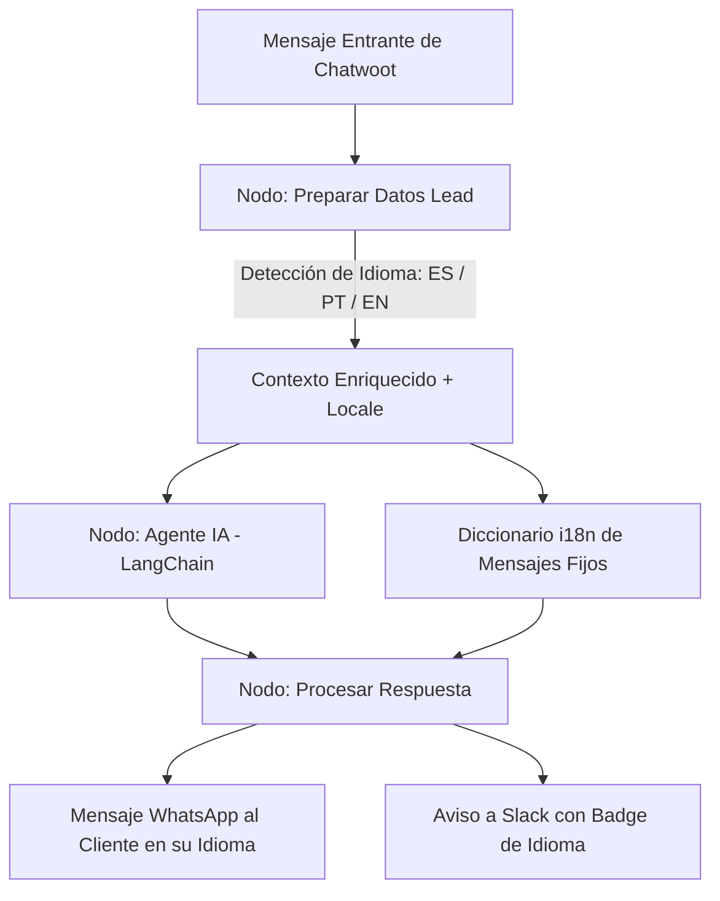

# Investigación y Diseño de Arquitectura: Soporte Multilingüe (Español, Inglés y Portugués)
## Agente Comercial de WhatsApp — Xtract (Proyecto 04)

**Fecha:** 24 de Agosto de 2026  
**Autor:** Senior Architecture & Engineering  
**Estado:** Documento de Investigación y Especificación Técnica (Listo para fase DEV)

---

## 1. Contexto y Caso Testigo Real (+55 William / Sensymed)

### 1.1 El Evento Observado
Un lead de Brasil (`+55 35 9118-4055`) completó el formulario de contacto web en portugués:
> *"Olá! Preenchi seu formulário e gostaria de saber mais sobre sua empresa. Qual sistema ERP vocês utilizam hoje?: Outro Work email: william@sensymed.com.br Qual é o principal problema que você está buscando resolver?: Lançamento manual de notas fiscais..."*

El sistema ejecutó el workflow `Closed Lost WhatsApp — 2. Recepción vía Chatwoot`:
1. Clasificó la conversación como `CONSULTA_GENERAL` (al no existir card previa en el CRM).
2. El bot derivó el lead a un comercial humano (Greta Bruno) y generó la notificación en Slack:
   ```text
   <!here> 🙋 Un cliente pide hablar con una persona
   William - sensymed +553591184055
   👤 Le toca a <@U096BLX5864>
   > Olá! Preenchi seu formulário...
   ⚠️ Sin card en Notion para este numero
   💬 <https://chatwoot.xtract.app/app/accounts/1/conversations/803|Responder en Chatwoot>
   ```
3. El mensaje que Chatwoot envió de vuelta al cliente de Brasil fue:
   > *"William, en breve lo atiende una persona del equipo."* (en **español**).

---

## 2. Diagnóstico Técnico de la Arquitectura Actual

El sistema actual tiene 4 componentes fuertemente acoplados al idioma español:

1. **System Prompt Monolingüe:**
   * Las directivas de rol, instrucciones de tono ("tratar siempre de USTED"), la base de conocimiento y los ejemplos de interacción están redactados 100% en español rioplatense/neutro.
   * En modo `CONSULTA_GENERAL`, la regla anti-invento y el filtro de intención ("si pide precios o demo, responde ESCALAR") derivan de inmediato al no poder procesar con fluidez las preguntas en otro idioma.
2. **Mensajes Deterministas y Fallbacks Hardcodeados:**
   * En `Preparar Datos Lead` y `Procesar Respuesta`, los mensajes fijos legales y operativos (`MSG_OPT_OUT`, `MSG_TOPE`, `msgEscalar`, `MSG_YA_ESCALADO`, `fueraDeTema`) son cadenas estáticas en español.
3. **Formateo de Fechas en Expresiones de n8n:**
   * La fecha actual se inyecta con `$now.setLocale('es')`, produciendo fechas en español (`lunes 24 de agosto`), confusas para un usuario angloparlante o lusoparlante.
4. **Falta de Detección y Contexto de Idioma:**
   * El grafo de n8n no computa la variable `idioma` ni la propaga hacia el prompt, hacia las respuestas fijas ni hacia el aviso de Slack.

---

## 3. Arquitectura Propuesta: Enfoque Unificado con i18n Dinámico



### Principio de Diseño:
* **Un Solo Grafo y Agente:** No duplicar workflows ni crear ramas separadas. El modelo LLM (DeepSeek / Llama 3.3) maneja la semántica multilingüe de forma nativa; el código determinista de JavaScript solo le suministra el contexto, el locale y los mensajes de fallback en el idioma correspondiente.

---

## 4. Especificaciones Técnicas por Componente

### 4.1 Capa 1: Detección de Idioma Determinista (`Preparar Datos Lead`)

Se añade una función de clasificación léxica y telefónica al inicio del nodo:

```javascript
function detectarIdioma(telefono, texto) {
  const d = String(telefono || '').replace(/\D/g, '');
  const t = String(texto || '').toLowerCase();

  // 1. Heurística fuerte por código de país
  if (d.startsWith('55')) return 'pt'; // Brasil
  if (d.startsWith('1') || d.startsWith('44')) return 'en'; // USA, Canadá, UK

  // 2. Análisis léxico de palabras clave en portugués
  const ptRegex = /\b(olá|preenchi|você|voces|obrigado|obrigada|faturas|notas fiscais|gostaria|empresa|sistema|atendimento|reunião|horário|sim|não)\b/i;
  if (ptRegex.test(t)) return 'pt';

  // 3. Análisis léxico de palabras clave en inglés
  const enRegex = /\b(hello|hi|hey|thanks|thank you|invoice|invoices|pricing|demo|meeting|schedule|schedule a call|erp|support|would like|help)\b/i;
  if (enRegex.test(t)) return 'en';

  // 4. Default: Español
  return 'es';
}
```

**Metadata exportada:**
* `idioma`: `'es'` | `'pt'` | `'en'`
* `locale`: `'es-AR'` | `'pt-BR'` | `'en-US'`
* `bandera`: `'🇪🇸'` | `'🇧🇷'` | `'🇺🇸'`

---

### 4.2 Capa 2: Adaptación del System Prompt (`Agente IA`)

Se incorporan directivas explícitas de correspondencia lingüística y localización:

```text
=== IDIOMA Y TONO DE ATENCIÓN (MANDATORIO) ===
Idioma detectado para esta conversación: {{ $json.idioma.toUpperCase() }}

1. Responda SIEMPRE en el mismo idioma en que escribe el cliente:
   - PORTUGUÉS: Escriba en portugués corporativo brasileño. Use el tratamiento formal 'você' (ej: "Olá William, como você está?", "Perfeito!", "Qual é o melhor horário para você?").
   - INGLÉS: Escriba en inglés profesional B2B conciso (ej: "Hello William, how are you?", "Perfect!", "What time works best for you?").
   - ESPAÑOL: Trate siempre de 'usted' con el estilo B2B habitual.

2. PUNTUACIÓN Y FORMATO:
   - En todos los idiomas: mensajes cortos (máximo 2 oraciones), sin emojis y usando únicamente signos de puntuación estándar (sin signos de apertura '¿' ni '¡').

3. FECHA Y HORA ACTUAL:
   {{ $now.setZone('America/Argentina/Buenos_Aires').setLocale($json.locale).toFormat("cccc dd 'de' LLLL 'de' yyyy, HH:mm") }}
```

---

### 4.3 Capa 3: Diccionario i18n para Respuestas Fijas y Fallbacks (`Procesar Respuesta`)

Para evitar enviar mensajes en español a clientes de habla inglesa o portuguesa cuando actúa una red de seguridad (opt-out, derivación, fuera de tema):

```javascript
const I18N = {
  es: {
    msgEscalar: (nom) => nom ? `${nom}, en breve lo atiende una persona del equipo.` : 'En breve lo atiende una persona del equipo.',
    msgYaEscalado: 'Ya le avisamos a un integrante del equipo, se va a comunicar con usted a la brevedad.',
    msgOptOut: 'Entendido. Damos de baja el contacto y no volveremos a escribirle. Disculpe la molestia.',
    msgTope: 'Prefiero que siga la conversación un integrante del equipo comercial, que le va a poder dar más detalle. Ya le paso el contacto.',
    msgSinTexto: 'Recibimos su mensaje. En breve lo atiende una persona del equipo.',
    fueraDeTema: 'Me voy a limitar a los temas de gestión de facturas y gastos, que es donde puedo serle útil. ¿Cómo viene hoy esa parte en su empresa?'
  },
  pt: {
    msgEscalar: (nom) => nom ? `${nom}, em breve um integrante da nossa equipe entrará em contato com você.` : 'Em breve um integrante da nossa equipe entrará em contato com você.',
    msgYaEscalado: 'Já notificamos nossa equipe, entraremos em contato com você o mais breve possível.',
    msgOptOut: 'Entendido. Removemos seu contato e não voltaremos a enviar mensagens. Pedimos desculpas pelo incômodo.',
    msgTope: 'Prefiro que um integrante da nossa equipe comercial continue a conversa para fornecer mais detalhes. Já estou transferindo o contato.',
    msgSinTexto: 'Recebemos sua mensagem. Em breve alguém da nossa equipe atenderá você.',
    fueraDeTema: 'Vou me limitar aos tópicos de gestão de faturas e despesas corporativas, onde posso ajudar melhor. Como está esse processo na sua empresa hoje?'
  },
  en: {
    msgEscalar: (nom) => nom ? `${nom}, a member of our team will reach out to you shortly.` : 'A member of our team will reach out to you shortly.',
    msgYaEscalado: 'We have notified our team, they will follow up with you shortly.',
    msgOptOut: 'Understood. We have removed your contact and will not reach out again. We apologize for any inconvenience.',
    msgTope: 'I would prefer a member of our sales team to continue this conversation to provide more details. I am passing along your contact.',
    msgSinTexto: 'We received your message. A team member will assist you shortly.',
    fueraDeTema: 'I will focus on invoice automation and expense management topics where I can be most helpful. How is your company currently handling that workflow?'
  }
};
```

---

### 4.4 Capa 4: Notificación Inteligente en Slack

En el nodo `Aviso a Slack cuando se escala`, se incluye el badge de idioma para que el comercial sepa inmediatamente cómo responder:

```javascript
const banderas = { es: ':flag-es: [Español]', pt: ':flag-br: [Português]', en: ':flag-us: [English]' };
const badgeIdioma = banderas[s.idioma] || ':globe_with_meridians:';

const texto = [
  '<!here> :raising_hand: Un cliente pide hablar con una persona ' + badgeIdioma,
  '*' + quien + '*  +' + soloDigitos(s.telefono),
  ':bust_in_silhouette: Le toca a ' + quienAtiende,
  '',
  cita,
  '',
  bloqueCard,
  ':speech_balloon: <' + linkCw + '|Responder en Chatwoot>'
].join('\n');
```

---

## 5. Matriz de Riesgos y Evaluación Adversarial

| Escenario de Riesgo | Causa Posible | Mitigación Arquitectónica |
| :--- | :--- | :--- |
| **Portuñol / Spanglish** | Mensaje híbrido (ej. *"Olá, me pasas precios?"*). | El análisis léxico detecta el idioma predominante; el LLM responde en el idioma de mayor cortesía sin romper la coherencia. |
| **Cambio de Idioma a Mitad de Charla** | El cliente arranca en inglés y luego habla en español. | El detector evalúa la ráfaga del último turno (`rafaga.join(' ')`), actualizando el contexto dinámicamente si el usuario cambia de idioma. |
| **Alucinación de Horarios por Zona Horaria** | Confusión entre huso horario de Brasilia (UTC-3), Argentina (UTC-3) o USA (EST/PST). | Las herramientas de Calendly operan estrictamente en UTC; el prompt aclara la zona horaria de referencia en el idioma correspondiente. |
| **Puntaje o Signos Rotos** | Inserción accidental de signos de apertura `¿` en inglés o portugués. | El sanitizador regex final `.replace(/[¿¡]/g, '')` se mantiene activo para todos los idiomas de salida. |

---

## 6. Plan de Ejecución sugerido (Cuando se apruebe el pase a DEV)

1. **Fase DEV (n8n.santiagowuerich.info):**
   * Incorporar la función `detectarIdioma` en el nodo `Preparar Datos Lead`.
   * Actualizar el nodo `Agente IA` con el prompt multilingüe y el locale dinámico.
   * Cargar el objeto `I18N` en `Procesar Respuesta` y `Armar salida`.
2. **Testing con Casos Mock (Protocolo de Pruebas):**
   * **Caso PT:** Payloads reales de Brasil (`+55...`, dudas de integración ERP en portugués, pedidos de reunión).
   * **Caso EN:** Payloads en inglés (`+1...`, consultas de facturas de compra y demo).
   * **Caso ES:** Regresión completa para asegurar que no se alteró el comportamiento actual.
3. **Diff & Gate Humano:**
   * Generar el reporte de validación y diff de nodos antes de la migración a PROD (`xtract.app`).
