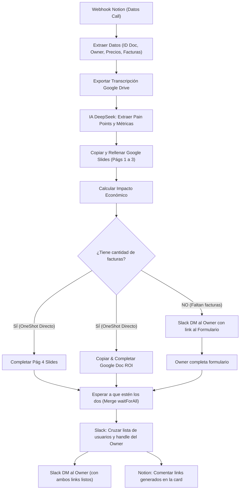

# Proyecto 05 — Generador de Slides y ROI desde Discovery Call

Automatización que procesa llamadas de discovery cargadas en Notion, extrae pain points y métricas con IA (DeepSeek), genera la propuesta comercial personalizada en **Google Slides** y el análisis de impacto/retorno en **Google Docs (ROI)**, notificando al owner por **Slack** y comentando la card en **Notion**.

---

## Estado
- **Estado:** ✅ **Activo en Producción**
- **Workflow n8n PROD:** `bAh0FYSFTM0UeXSc`
- **Workflow n8n DEV:** `XToQjOesjjENHm1n`

---

## Flujo Operativo

---

## Integraciones y Credenciales Requeridas

| Servicio | Tipo n8n | Nombre en PROD | Credential ID |
| :--- | :--- | :--- | :--- |
| DeepSeek | `deepSeekApi` | `SantiagoApikey` | `H5fC2aZoNphCCole` |
| Google Slides | `googleSlidesOAuth2Api` | `Xtract cred-santiagow` | `2zf62ANt1cqLYK9N` |
| Google Drive | `googleDriveOAuth2Api` | `Xtract cred-santiagow` | `2nHeE2yjp5ghofd4` |
| Google Docs | `googleDocsOAuth2Api` | `Xtract cred-santiagow` | `llGqVQqRBjrz3XhU` |
| Service Account | `jwtAuth` | `Service Account Xtract transcripts-reader` | `B3KwxGmlrCCTgAHk` |
| Slack (OAuth2) | `slackOAuth2Api` | `Slack account 3` | `LOGlZWLcdTggazKj` |
