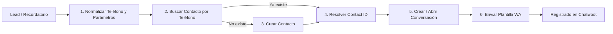

# Guía de Implementación: Envío de Plantillas WhatsApp Sincronizadas con Chatwoot

Esta guía explica la arquitectura, requerimientos y los **nodos de n8n listos para copiar y pegar** para enviar plantillas aprobadas de WhatsApp (Meta Cloud API) de forma que **la conversación y el mensaje queden registrados en el panel de Chatwoot**.

---

## 1. El Problema Arquitectónico

* **Envío Directo a Meta (Graph API):** Si enviás la plantilla llamando directo a `graph.facebook.com/.../messages`, Meta entrega el mensaje al teléfono del destinatario, pero **Chatwoot nunca se entera**. Cuando el cliente responde, en Chatwoot aparece un mensaje entrante huérfano sin contexto previo ni historial.
* **Envío a través de Chatwoot API:** Al solicitar el envío de la plantilla al endpoint `/messages` de Chatwoot con el objeto `template_params`, Chatwoot despacha la plantilla a Meta y **registra inmediatamente el mensaje saliente en la conversación**, manteniendo el historial unificado para todo el equipo.

---

## 2. Flujo de 4 Pasos en Chatwoot

Para enviar una plantilla por Chatwoot se requiere seguir este ciclo:



1. **Buscar Contacto** (`GET /api/v1/accounts/{account_id}/contacts/search?q=+...`): Revisa si el número ya existe para no duplicar contactos en la libreta.
2. **Crear Contacto** (`POST /api/v1/accounts/{account_id}/contacts`): Solo se ejecuta si el contacto no existía.
3. **Crear / Abrir Conversación** (`POST /api/v1/accounts/{account_id}/conversations`): Obtiene o genera la conversación activa en el Inbox de WhatsApp.
4. **Enviar Plantilla WA** (`POST /api/v1/accounts/{account_id}/conversations/{conversation_id}/messages`): Despacha la plantilla aprobada en Meta y deja asentado el mensaje saliente.

---

## 3. Configuración Requerida

### Variables en el nodo `Config Chatwoot`
* `CHATWOOT_URL`: URL base de la instancia (ej: `https://chatwoot.xtract.app`). Sin barra final.
* `CHATWOOT_ACCOUNT_ID`: ID numérico de la cuenta (usualmente `1`).
* `CHATWOOT_INBOX_ID`: ID del Inbox conectado a WhatsApp Cloud.

### Credencial en n8n
* **Tipo:** Header Auth (`httpHeaderAuth`)
* **Nombre de la credencial:** `Chatwoot API`
* **Nombre del Header:** `api_access_token`
* **Valor:** Tu User Access Token (se obtiene en Chatwoot en *Configuración de Perfil ➔ Token de Acceso*).

---

## 4. Estructura de la Plantilla (`template_params`)

Meta exige que los mensajes salientes inicien con una plantilla aprobada:

```json
{
  "content": "Hola Juan, te recordamos tu reunión para hoy a las 15:00 hs. Link: https://meet.google.com/abc-defg-hij",
  "message_type": "outgoing",
  "template_params": {
    "name": "recordatorio_reunion_1",
    "category": "utility",
    "language": "es_AR",
    "processed_params": {
      "1": "Juan",
      "2": "hoy a las 15:00 hs",
      "3": "https://meet.google.com/abc-defg-hij"
    }
  }
}
```

* `name`: Nombre exacto de la plantilla en Meta (en minúsculas con guiones bajos).
* `category`: `utility` (recordatorios, soporte) o `marketing`.
* `language`: Código ISO del idioma (`es_AR`, `es`, `es_MX`, etc.).
* `processed_params`: Mapeo de variables dinámicas `{{1}}`, `{{2}}`, `{{3}}`.
* `content`: Texto renderizado que verá el equipo dentro de Chatwoot.

---

## 5. Nodos de n8n Listos para Importar / Pegar

Copiá el siguiente bloque JSON y pegalo con `Ctrl + V` o `Cmd + V` directamente sobre el lienzo de n8n:

```json
{
  "name": "Módulo Chatwoot — Envío Plantillas WA",
  "nodes": [
    {
      "parameters": {
        "content": "### 🚀 Módulo Chatwoot — Envío de Plantillas WhatsApp\n\n**Flujo requerido por Chatwoot:**\n1. **Buscar Contacto** por teléfono E.164.\n2. Si no existe ➔ **Crearlo** en el Inbox de WhatsApp.\n3. **Crear / Abrir Conversación** para ese contacto.\n4. **Enviar Mensaje de Plantilla** (Meta Template) asociado a la conversación.\n\n*Con esto la conversación y el mensaje quedan visibles y registrados para todo el equipo en Chatwoot.*",
        "height": 280,
        "width": 620,
        "color": 5
      },
      "id": "sticky-info-chatwoot",
      "name": "Sticky Note Chatwoot",
      "type": "n8n-nodes-base.stickyNote",
      "typeVersion": 1,
      "position": [-400, 100]
    },
    {
      "parameters": {
        "jsCode": "// -----------------------------------------------------\n// 1. CONFIGURACIÓN DE TU INSTANCIA DE CHATWOOT\n// -----------------------------------------------------\nreturn [{\n  json: {\n    CHATWOOT_URL: 'https://chatwoot.xtract.app', // URL de Chatwoot sin barra final\n    CHATWOOT_ACCOUNT_ID: '1',                    // ID numérico de la cuenta en Chatwoot\n    CHATWOOT_INBOX_ID: '1'                       // ID del Inbox de WhatsApp Cloud\n  }\n}];"
      },
      "id": "node-config-chatwoot",
      "name": "Config Chatwoot",
      "type": "n8n-nodes-base.code",
      "typeVersion": 2,
      "position": [-380, 420]
    },
    {
      "parameters": {
        "jsCode": "// -----------------------------------------------------\n// 2. NORMALIZADOR DE ENTRADA Y PARÁMETROS DE PLANTILLA\n// Adapta los campos que vienen de tu trigger/webhook/hoja\n// -----------------------------------------------------\nconst items = $input.all();\nconst cfg = $('Config Chatwoot').first().json;\n\nreturn items.map(item => {\n  const data = item.json;\n  \n  // Normalizar teléfono a formato internacional (+549... / +51... / etc)\n  let rawTel = String(data.telefono || data.phone || data.whatsapp || '').replace(/[^0-9]/g, '');\n  if (rawTel.startsWith('00')) rawTel = rawTel.slice(2);\n  \n  if (rawTel.startsWith('54') && !rawTel.startsWith('549') && rawTel.length >= 10) {\n    rawTel = '549' + rawTel.slice(2);\n  }\n  const telE164 = '+' + rawTel;\n\n  // Datos de la plantilla aprobada en Meta\n  const templateName = data.template_name || 'recordatorio_reunion_1';\n  const templateLang = data.template_lang || 'es_AR';\n  const templateCategory = data.template_category || 'utility'; // 'utility' o 'marketing'\n\n  // Parámetros de la plantilla ({{1}}, {{2}}, {{3}}, etc.)\n  const p1 = String(data.param_1 || data.nombre || '');\n  const p2 = String(data.param_2 || data.fecha_hora || '');\n  const p3 = String(data.param_3 || data.link_reunion || '');\n  const p4 = String(data.param_4 || '');\n\n  const processedParams = {};\n  if (p1) processedParams['1'] = p1;\n  if (p2) processedParams['2'] = p2;\n  if (p3) processedParams['3'] = p3;\n  if (p4) processedParams['4'] = p4;\n\n  // Texto representativo para previsualizar en el dashboard de Chatwoot\n  let previewText = data.preview_text || `Hola ${p1}, te recordamos tu reunión para ${p2}. Link: ${p3}`;\n\n  return {\n    json: {\n      ...data,\n      telefono_normalizado: rawTel,\n      telefono_e164: telE164,\n      nombre_contacto: data.nombre || p1 || 'Contacto',\n      template_name: templateName,\n      template_lang: templateLang,\n      template_category: templateCategory,\n      processed_params: processedParams,\n      preview_text: previewText.trim()\n    }\n  };\n});"
      },
      "id": "node-preparar-datos",
      "name": "Preparar Datos y Template",
      "type": "n8n-nodes-base.code",
      "typeVersion": 2,
      "position": [-160, 420]
    },
    {
      "parameters": {
        "url": "={{ $('Config Chatwoot').first().json.CHATWOOT_URL }}/api/v1/accounts/{{ $('Config Chatwoot').first().json.CHATWOOT_ACCOUNT_ID }}/contacts/search",
        "authentication": "genericCredentialType",
        "genericAuthType": "httpHeaderAuth",
        "sendQuery": true,
        "queryParameters": {
          "parameters": [
            {
              "name": "q",
              "value": "={{ $json.telefono_e164 }}"
            }
          ]
        },
        "options": {
          "response": {
            "response": {
              "neverError": true
            }
          },
          "timeout": 30000
        }
      },
      "id": "node-buscar-contacto",
      "name": "Chatwoot - Buscar Contacto",
      "type": "n8n-nodes-base.httpRequest",
      "typeVersion": 4.2,
      "position": [80, 420],
      "credentials": {
        "httpHeaderAuth": {
          "id": "BjYt68eHeT61ihqb",
          "name": "Chatwoot API"
        }
      },
      "onError": "continueRegularOutput"
    },
    {
      "parameters": {
        "conditions": {
          "options": {
            "caseSensitive": true,
            "leftValue": "",
            "typeValidation": "loose",
            "version": 1
          },
          "conditions": [
            {
              "leftValue": "={{ $json.payload }}",
              "operator": {
                "type": "array",
                "operation": "notEmpty"
              }
            }
          ],
          "combinator": "and"
        },
        "options": {}
      },
      "id": "node-existe-contacto",
      "name": "Existe el Contacto?",
      "type": "n8n-nodes-base.if",
      "typeVersion": 2.2,
      "position": [300, 420]
    },
    {
      "parameters": {
        "method": "POST",
        "url": "={{ $('Config Chatwoot').first().json.CHATWOOT_URL }}/api/v1/accounts/{{ $('Config Chatwoot').first().json.CHATWOOT_ACCOUNT_ID }}/contacts",
        "authentication": "genericCredentialType",
        "genericAuthType": "httpHeaderAuth",
        "sendBody": true,
        "specifyBody": "json",
        "jsonBody": "={{ JSON.stringify({\n  inbox_id: $('Config Chatwoot').first().json.CHATWOOT_INBOX_ID,\n  name: $('Preparar Datos y Template').item.json.nombre_contacto,\n  phone_number: $('Preparar Datos y Template').item.json.telefono_e164,\n  custom_attributes: {\n    canal_origen: 'WhatsApp Reminders'\n  }\n}) }}",
        "options": {
          "response": {
            "response": {
              "neverError": true
            }
          },
          "timeout": 30000
        }
      },
      "id": "node-crear-contacto",
      "name": "Chatwoot - Crear Contacto",
      "type": "n8n-nodes-base.httpRequest",
      "typeVersion": 4.2,
      "position": [520, 520],
      "credentials": {
        "httpHeaderAuth": {
          "id": "BjYt68eHeT61ihqb",
          "name": "Chatwoot API"
        }
      },
      "onError": "continueRegularOutput"
    },
    {
      "parameters": {
        "mode": "runOnceForEachItem",
        "jsCode": "// Resolver Contact ID sin importar si ya existía o se acaba de crear\nconst original = $('Preparar Datos y Template').item.json;\nconst resp = $input.item.json || {};\n\nlet contactId = null;\nif (Array.isArray(resp.payload) && resp.payload.length > 0) {\n  contactId = resp.payload[0].id;\n} else if (resp.payload && resp.payload.contact && resp.payload.contact.id) {\n  contactId = resp.payload.contact.id;\n} else if (resp.payload && resp.payload.id) {\n  contactId = resp.payload.id;\n} else if (resp.id) {\n  contactId = resp.id;\n}\n\nreturn [{\n  json: {\n    ...original,\n    chatwoot_contact_id: contactId\n  }\n}];"
      },
      "id": "node-resolver-contact-id",
      "name": "Resolver Contact ID",
      "type": "n8n-nodes-base.code",
      "typeVersion": 2,
      "position": [740, 420]
    },
    {
      "parameters": {
        "method": "POST",
        "url": "={{ $('Config Chatwoot').first().json.CHATWOOT_URL }}/api/v1/accounts/{{ $('Config Chatwoot').first().json.CHATWOOT_ACCOUNT_ID }}/conversations",
        "authentication": "genericCredentialType",
        "genericAuthType": "httpHeaderAuth",
        "sendBody": true,
        "specifyBody": "json",
        "jsonBody": "={{ JSON.stringify({\n  source_id: $json.telefono_e164,\n  inbox_id: $('Config Chatwoot').first().json.CHATWOOT_INBOX_ID,\n  contact_id: $json.chatwoot_contact_id,\n  status: 'open'\n}) }}",
        "options": {
          "response": {
            "response": {
              "neverError": true
            }
          },
          "timeout": 30000
        }
      },
      "id": "node-crear-conversacion",
      "name": "Chatwoot - Crear Conversación",
      "type": "n8n-nodes-base.httpRequest",
      "typeVersion": 4.2,
      "position": [960, 420],
      "credentials": {
        "httpHeaderAuth": {
          "id": "BjYt68eHeT61ihqb",
          "name": "Chatwoot API"
        }
      },
      "onError": "continueRegularOutput"
    },
    {
      "parameters": {
        "method": "POST",
        "url": "={{ $('Config Chatwoot').first().json.CHATWOOT_URL }}/api/v1/accounts/{{ $('Config Chatwoot').first().json.CHATWOOT_ACCOUNT_ID }}/conversations/{{ $json.id }}/messages",
        "authentication": "genericCredentialType",
        "genericAuthType": "httpHeaderAuth",
        "sendBody": true,
        "specifyBody": "json",
        "jsonBody": "={{ JSON.stringify({\n  content: $('Resolver Contact ID').item.json.preview_text,\n  message_type: 'outgoing',\n  template_params: {\n    name: $('Resolver Contact ID').item.json.template_name,\n    category: $('Resolver Contact ID').item.json.template_category,\n    language: $('Resolver Contact ID').item.json.template_lang,\n    processed_params: $('Resolver Contact ID').item.json.processed_params\n  }\n}) }}",
        "options": {
          "response": {
            "response": {
              "neverError": true
            }
          },
          "timeout": 30000
        }
      },
      "id": "node-enviar-plantilla-wa",
      "name": "Chatwoot - Enviar Plantilla WA",
      "type": "n8n-nodes-base.httpRequest",
      "typeVersion": 4.2,
      "position": [1180, 420],
      "credentials": {
        "httpHeaderAuth": {
          "id": "BjYt68eHeT61ihqb",
          "name": "Chatwoot API"
        }
      },
      "onError": "continueRegularOutput"
    }
  ],
  "connections": {
    "Config Chatwoot": {
      "main": [
        [
          {
            "node": "Preparar Datos y Template",
            "type": "main",
            "index": 0
          }
        ]
      ]
    },
    "Preparar Datos y Template": {
      "main": [
        [
          {
            "node": "Chatwoot - Buscar Contacto",
            "type": "main",
            "index": 0
          }
        ]
      ]
    },
    "Chatwoot - Buscar Contacto": {
      "main": [
        [
          {
            "node": "Existe el Contacto?",
            "type": "main",
            "index": 0
          }
        ]
      ]
    },
    "Existe el Contacto?": {
      "main": [
        [
          {
            "node": "Resolver Contact ID",
            "type": "main",
            "index": 0
          }
        ],
        [
          {
            "node": "Chatwoot - Crear Contacto",
            "type": "main",
            "index": 0
          }
        ]
      ]
    },
    "Chatwoot - Crear Contacto": {
      "main": [
        [
          {
            "node": "Resolver Contact ID",
            "type": "main",
            "index": 0
          }
        ]
      ]
    },
    "Resolver Contact ID": {
      "main": [
        [
          {
            "node": "Chatwoot - Crear Conversación",
            "type": "main",
            "index": 0
          }
        ]
      ]
    },
    "Chatwoot - Crear Conversación": {
      "main": [
        [
          {
            "node": "Chatwoot - Enviar Plantilla WA",
            "type": "main",
            "index": 0
          }
        ]
      ]
    }
  }
}
```

---

## 6. Errores Comunes y Puntos Críticos

1. **Teléfonos de Argentina:** Si el número es argentino (`+54`), WhatsApp Cloud exige el dígito `9` antes del código de área (ej: `+54 9 11 ...`). Sin el `9`, WhatsApp lo toma como teléfono fijo y el mensaje falla silenciosamente. El nodo `Preparar Datos y Template` ya incluye esta corrección automática.
2. **Nombre de la Plantilla:** Debe coincidir exactamente con el aprobado en Meta Business Suite (sensible a mayúsculas/minúsculas).
3. **Cantidad de Variables:** Si la plantilla tiene 3 variables (`{{1}}`, `{{2}}`, `{{3}}`), el objeto `processed_params` debe enviar exactamente las 3 claves. Si falta alguna, Meta rechaza el mensaje con error `100 Invalid parameter`.
