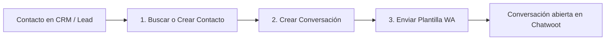

# Guía de Implementación: Envío de Plantillas de WhatsApp sincronizadas con Chatwoot

Esta guía explica la arquitectura y los pasos para enviar plantillas aprobadas de WhatsApp (Meta Cloud API) a través de n8n de manera que **la conversación y el mensaje saliente queden registrados en el panel de Chatwoot**.

---

## 1. El Problema Arquitectónico

* **Envío Directo a Meta:** Si enviás la plantilla llamando a `graph.facebook.com/vXX.X/.../messages`, Meta entrega el mensaje al teléfono del destinatario, pero **Chatwoot nunca se entera**. Cuando el cliente responde, en Chatwoot aparece un mensaje entrante huérfano sin contexto previo ni historial.
* **Envío a través de Chatwoot:** Al solicitar el envío de la plantilla al endpoint `/messages` de Chatwoot con el objeto `template_params`, Chatwoot despacha la plantilla a Meta y **registra inmediatamente el mensaje saliente en la conversación**, manteniendo el historial unificado.

---

## 2. Flujo de 3 Pasos en n8n



### Paso 1: Crear o Buscar Contacto en Chatwoot (Si no existe)
* **Método:** `POST`
* **URL:** `https://[TU_CHATWOOT_URL]/api/v1/accounts/[ACCOUNT_ID]/contacts`
* **Headers:** `api_access_token: [CHATWOOT_USER_API_TOKEN]`
* **Body:**
```json
{
  "inbox_id": [INBOX_ID],
  "name": "Juan Pérez",
  "phone_number": "+5491112345678",
  "custom_attributes": {
    "empresa": "Mi Empresa",
    "origen": "Reactivación"
  }
}
```

---

### Paso 2: Crear la Conversación
* **Método:** `POST`
* **URL:** `https://[TU_CHATWOOT_URL]/api/v1/accounts/[ACCOUNT_ID]/conversations`
* **Headers:** `api_access_token: [CHATWOOT_USER_API_TOKEN]`
* **Body:**
```json
{
  "source_id": "+5491112345678",
  "inbox_id": [INBOX_ID],
  "contact_id": 12345,
  "status": "open"
}
```
> **Nota:** La respuesta devuelve el `id` de la conversación recién creada (ej: `{"id": 8901, ...}`).

---

### Paso 3: Enviar la Plantilla de WhatsApp
* **Método:** `POST`
* **URL:** `https://[TU_CHATWOOT_URL]/api/v1/accounts/[ACCOUNT_ID]/conversations/{{ $json.id }}/messages`
* **Headers:** `api_access_token: [CHATWOOT_USER_API_TOKEN]`
* **Body:**
```json
{
  "content": "Hola Juan, te escribo por el seguimiento del sistema Tango en Mi Empresa.",
  "message_type": "outgoing",
  "template_params": {
    "name": "nombre_de_la_plantilla_aprobada_en_meta",
    "category": "marketing",
    "language": "es_AR",
    "processed_params": {
      "1": "Juan",
      "2": "Tango",
      "3": "Mi Empresa"
    }
  }
}
```

#### Parámetros clave del objeto `template_params`:
1. `name`: Nombre exacto con el que se creó y aprobó la plantilla en Meta Business Manager (en minúsculas y con guiones bajos).
2. `category`: Categoría asignada en Meta (`marketing` o `utility`).
3. `language`: Código ISO del idioma (ej: `es_AR`, `es_ES`, `es_LA`).
4. `processed_params`: Objeto clave-valor con los números de variable `{{1}}`, `{{2}}`, `{{3}}` mapeados a sus valores dinámicos.
5. `content`: Texto completo renderizado. Chatwoot lo usa para mostrar la previsualización visual a los agentes humanos en la UI.

---

## 3. Nodos de n8n Listos para Copiar y Pegar

Podés copiar el siguiente bloque JSON y pegarlo directamente en el canvas de n8n (`Ctrl+V` o `Cmd+V`):

```json
[
  {
    "parameters": {
      "method": "POST",
      "url": "={{ $json.chatwoot_url }}/api/v1/accounts/{{ $json.account_id }}/conversations",
      "authentication": "genericCredentialType",
      "genericAuthType": "httpHeaderAuth",
      "sendBody": true,
      "specifyBody": "json",
      "jsonBody": "={{ JSON.stringify({\n  source_id: $json.telefono_e164,\n  inbox_id: $json.inbox_id,\n  contact_id: $json.contact_id,\n  status: \"open\"\n}) }}",
      "options": {
        "response": {
          "response": {
            "neverError": true
          }
        },
        "timeout": 30000
      }
    },
    "name": "Chatwoot - Crear conversacion",
    "type": "n8n-nodes-base.httpRequest",
    "typeVersion": 4.2,
    "position": [
      100,
      300
    ]
  },
  {
    "parameters": {
      "method": "POST",
      "url": "={{ $('Chatwoot - Crear conversacion').item.json.chatwoot_url || $json.chatwoot_url }}/api/v1/accounts/{{ $('Chatwoot - Crear conversacion').item.json.account_id || $json.account_id }}/conversations/{{ $json.id }}/messages",
      "authentication": "genericCredentialType",
      "genericAuthType": "httpHeaderAuth",
      "sendBody": true,
      "specifyBody": "json",
      "jsonBody": "={{ JSON.stringify({\n  content: $json.texto_preview,\n  message_type: \"outgoing\",\n  template_params: {\n    name: $json.template_name,\n    category: \"marketing\",\n    language: \"es_AR\",\n    processed_params: {\n      \"1\": $json.var1,\n      \"2\": $json.var2\n    }\n  }\n}) }}",
      "options": {
        "response": {
          "response": {
            "neverError": true
          }
        },
        "timeout": 30000
      }
    },
    "name": "Chatwoot - Enviar plantilla WA",
    "type": "n8n-nodes-base.httpRequest",
    "typeVersion": 4.2,
    "position": [
      340,
      300
    ]
  }
]
```

---

## 4. Configuración de la Credencial en n8n
* **Tipo de autenticación:** `Header Auth` (`genericCredentialType` -> `httpHeaderAuth`).
* **Name:** `api_access_token`
* **Value:** Tu token de usuario de Chatwoot (se obtiene en Chatwoot -> *Profile Settings* -> *Access Token*).
