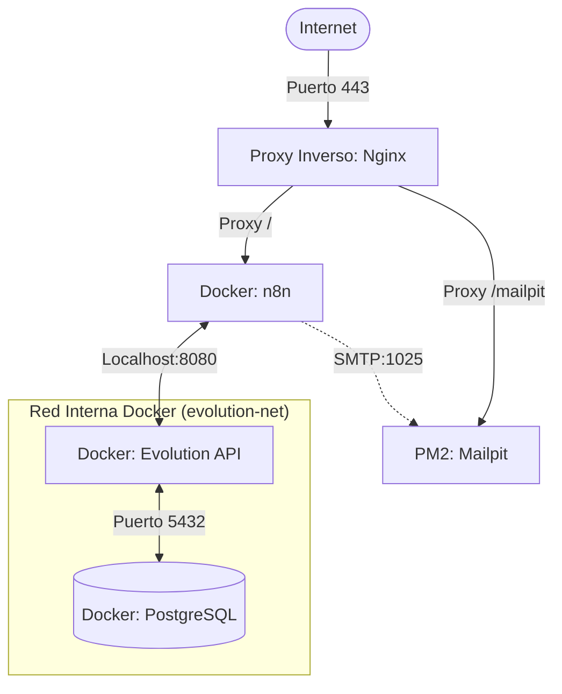

# Infraestructura Principal - Servidor Oracle Cloud

Este archivo documenta la infraestructura del servidor en producción y las configuraciones de red y seguridad globales.

---

## 🌐 Configuración del Servidor
*   **IP Pública del Servidor:** `157.151.13.179`
*   **Sistema Operativo:** Ubuntu 22.04 LTS (Arquitectura ARM64)
*   **Seguridad / HTTPS:** Habilitada mediante Nginx (puerto 443 seguro) con redirección automática desde el puerto HTTP 80.
*   **Administrador de Procesos:** PM2 gestiona los procesos locales bajo el usuario `ubuntu`.

---

## 📦 Arquitectura de Servicios y Contenedores

### Detalle de Puertos y Servicios Internos
*   **Nginx (Host VM):** Escucha en `80` y `443`. Proxy pasa las rutas públicas.
*   **n8n (Docker):** Corre en la versión `2.29.10` (latest). Bound a `127.0.0.1:5678`. Base de datos persistente mapeada en `/home/ubuntu/.n8n`.
*   **Mailpit (Host VM - PM2):** Escucha en `1025` (SMTP) y `8025` (Web UI). Expuesto en `/mailpit/`.
*   **Evolution API (Docker):** Escucha en `127.0.0.1:8080`. API Key: `st_evolution_key_2026`.
*   **PostgreSQL (Docker):** Base de datos dedicada para Evolution API. Totalmente privada dentro de la red virtual de Docker `evolution-net`.

---

## 🔑 Seguridad Global (Token Auth)
Todas las solicitudes de API y webhooks (excepto la carga del HTML del portal) requieren la siguiente cabecera HTTP de validación:
*   **Header Name:** `X-API-Key`
*   **Header Value:** `st_sec_token_9051226d`
